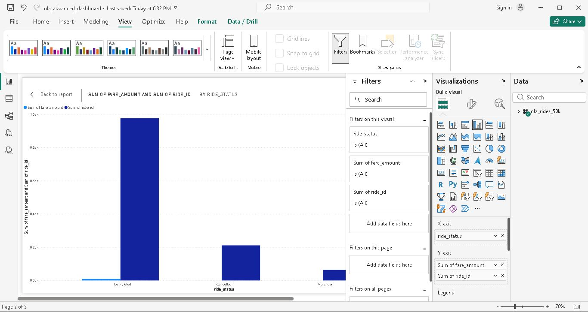

# 🚖 Ola Ride Analytics – Advanced (50K Records)

## 📌 Project Overview
This project analyzes 50,000 ride records to identify revenue drivers, surge pricing impact, and driver performance.

## 🛠 Tools Used
- SQL
- Python
- Power BI
- Excel

## 📊 Key Metrics
- Total Revenue
- Cancellation Rate
- Driver Ranking
- Surge Impact
- City Performance

## 🚀 How to Run
1. Run generate_data.py
2. Load CSV into SQL / Power BI
3. Run SQL queries
4. Execute Python notebook

## 📷 Dashboard Preview
